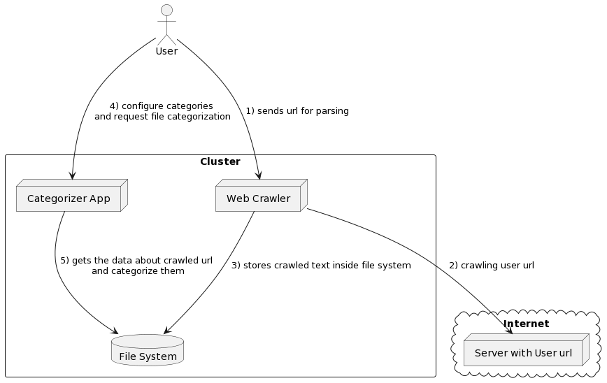
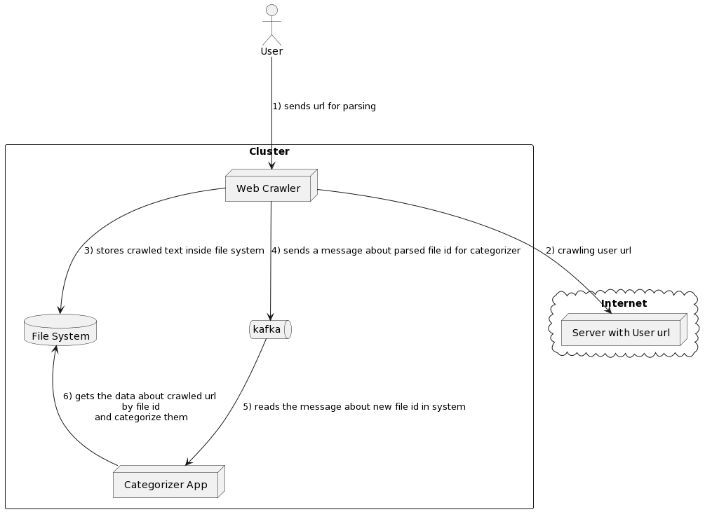

# url-data-categorizer

 

All product-related readme files have been added to the apps level and contain further enhancements and assumptions about architecture and problems.

This is a small example how is the categorization work in the internet. Let's create an assumption that we have 2 microservices: 
- 1) is a simple but powerfull crawler which is prsing urls and storing data to the HDD;
- 2) categorizer which is used pre-configured categories and keywords for finding the category inside url text.

First app created using Akka which is very fast actor based engine and the second app uses  Aho-Corasick algorithm for categorization.

### improvements
There is one oblivious improvement to make the crawler async... 
Also, I'm willing to propose the following change to my present solution which will help to be fully-async. I'm wondering if I may add a queue (probably Apache Kafka for heavy load) between crawler and categorizer. 
It may work in docker compose for the local setup, but also can work on orchestrators (k8s?). For that case architecture could be like at the following image:

 